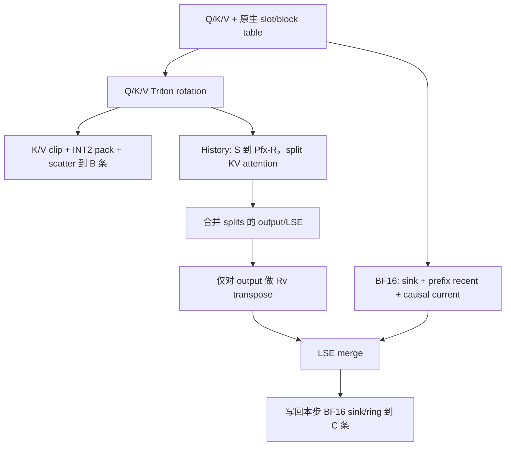

# OSCAR INT2 → Qwen3.5 / Ascend 实施设计

设计日期：2026-09-08。目标是本地 `references/vllm-ascend` 的
`19e436985102f4ed3aad36c137a6481653688a6c`（v0.23.0 + PR #12607），
配套 vLLM `0fc695fc6d1d82e9a5ac6835ac8e4e1c83703665`。
参考目录只读。本实现不依赖其 Python import path，不复用旧适配工程。

v0.2.1 的部署版本规则：vLLM 0.23.0、Ascend 0.23.0/0.23.1，允许 PEP 440
开发版与 local build 后缀。现场版本 `0.23.1.dev0+g5cb98caaa.d20260822` 中的
`5cb98caaa` 对应参考 Git 的 v0.23.0 tag；版本标签本身不能证明工作树内容或是否包含额外 PR。
运行时以所需接口检查和实际 KV tensor geometry 为准，源码哈希仅作审计信息；
本地 `--sources-only` 仍严格校验参考文件。版本/接口检查通过不代表 NPU 数值和性能验收通过。

v0.2.3 将预检改为纯 AST 源码读取，不执行原生模块初始化。
服务插件只包装平台的 backend selector，并在原生 Attention 完成导入后安装构造/
weight-loading hook；目标 runner 会在加载模型前探测 backend。
校准插件注册只检查版本，在模型初始化完成后的 begin RPC 中才安装采样 hook。
原生 global/worker patch 的时序由 vLLM Ascend 自己管理，扩展不手动调用
`_ensure_global_patch`，避免 `device_op → ops → fused_moe → device_op` 循环。

## 1. 事实、范围与验收

- FULL head_dim=256；Q heads=24，KV heads=4；TP4 每卡 Q=6、KV=1。
  GDN head_dim=128，与 FULL 的 256 维无关。
- INT2 = **2 bit/element、4 elements/byte**，不是 4 bit/element。
- 上游 OSCAR PR 的实际 D=256 单组格式为 K `(64+4)` + V `(64+4)`
  = **136 bytes**。这里保留该格式语义，外层 slot 对齐到 **160 bytes**，
  padding=24 bytes；不是 128+24=160。group_size=256，禁止仅改元数据为两组。
- S=64、R=256 是**请求全局窗口**，不能对每个物理页重复套用。
- 只压缩 FULL attention。权重量化仍由 `--quantization ascend` 负责。
- 第一版保留原生 KVCacheSpec、三条物理分区、分组、页号机制和 128-token
  kernel block table；不宣称节省原生分配显存或提高可分配页数。
  优化对象是历史 KV 的读取流量。实际可分配页数仍由原生 memory profiling
  决定；新增 current-token scratch 也会占用预算，不能承诺页数与 baseline 相同。
- “不慢于原生”是必须在 NPU 上满足的验收条件，不是推导出的性能结论。
  Mac 上单元测试不证明 Triton Ascend 编译、图回放、质量或吞吐通过。

## 2. 外部集成点

| 新文件 / 类或函数 | 功能 | 上游接缝 |
|---|---|---|
| `oscar_ascend.plugin.register` | general plugin、幂等平台选择 wrapper | `NPUPlatform.get_attn_backend_cls` |
| `OscarAttentionBackend` | 仅 decoder dense FULL 使用 OSCAR，保持原生 cache shape | `AscendAttentionBackend` 子类 |
| `OscarMetadataBuilder` | 稳定 NPU metadata buffer；不读回 NPU seq_lens | `AttentionMetadataBuilder.build/build_for_cudagraph_capture` |
| `OscarAttentionImpl` | 调度 rotation/store/两路 attention/LSE merge | `AttentionImpl.forward` |
| `layout.CacheLayout` | K/V 原生 views 上计算 packed/ring 地址 | 原生 `_allocate/_reshape_kv_cache_tensors` 的输出 |
| `kernels` | 全部量化相关计算使用 Triton | `import triton; import triton.language as tl` |
| `rotations` | 启动时读取并校验该模型的离线矩阵 | OSCAR PR checkpoint 格式 |
| `scripts/serve.sh` | 安装外部包、检查环境、保留 TP4/MTP/async 启动参数 | `vllm.general_plugins` |

不改 runner、scheduler、GDN、Qwen 模型或 Ascend 原文件，不借用 TurboQuant dtype。
vLLM 0.23.0 不认识 `oscar_int2` CLI enum，因此使用 `--kv-cache-dtype auto`，
通过 `OSCAR_ASCEND_ENABLED=1` 选择扩展；保留 PR 的 `VLLM_OSCAR_*` 配置名。
按 selector 的 decoder 类型选择后端，encoder/vision/GDN 不会进入量化 kernel。
不支持 MLA、SWA、KV connector、CP、cross-layer sharing、C8 KV 叠加。
MTP draft 的 `mtp.layers.*` 使用原生后端及 BF16 cache；只量化主模型16个 FULL 层。
主模型 target verification 的多个 candidate queries 进入 fused OSCAR kernel。
这避免将主模型层号/rotation错误套用到独立 draft 权重。construction hook 在
`Attention.__init__` 显式选择 native draft backend，weight-loading hook 初始化主模型矩阵。

## 3. 页内地址与隔离证明

设物理分配页 token 容量 Bp，kernel block 容量 Bk=128，r=Bp/Bk。
目标常见 Bp=768、Hkv=1、D=256；运行时校验，不硬编码页数或 A 区大小。
原生 FULL 的 `k_cache/v_cache` contiguous view 分别覆盖 B/C 全条。

```text
raw shared slab (nb * P bytes)
 A: conv                  | B: K / ssm                 | C: V / GDN padding
 原生 GDN view 不变         | GDN 页按原生 dtype/shape     | GDN 不使用
 FULL 页不写 A             | FULL 页前部存 packed history | FULL 首页存 sink+ring
```

同一个 Tensor 的 `shared_by` 表示多个层共用底层池；**并不表示同时存活的
FULL/GDN 数据使用同一个物理页号**。scheduler 的统一 block pool 分配不同页号，
这是原生实现本身也必须依赖的隔离条件。

原生每页每条长度 `J = Bp * Hkv * D * 2` bytes。
用户给定例子：J=393216，A_per_page=15360，P=A_per_page+2J=801792。
MTP 会影响 conv state 大小，A/P 以现场实际 spec 为准。

对 kernel slot `s`：

```text
physical_page = floor(s / Bp)
token_in_page = s mod Bp
packed_base   = B_start + physical_page * J
packed_addr   = packed_base + (token_in_page * Hkv + h) * 160

slot +   0..63 : K codes (q[4i] | q[4i+1]<<2 | q[4i+2]<<4 | q[4i+3]<<6)
slot +  64..65 : K scale, IEEE fp16 little endian
slot +  66..67 : K minimum, IEEE fp16 little endian
slot +  68..131: V codes
slot + 132..133: V scale
slot + 134..135: V minimum
slot + 136..159: reserved padding
```

查询逻辑 token t 时，先用原生表 `b = block_table[req, t//128]`，
再令 `s=b*128+t%128`，套上式。不能把虚拟 kernel block b 当作物理页 p。

BF16 窗口不按 batch row 索引，按该请求**首个物理页**索引：

```text
owner = block_table[req, 0] // r
C = R + num_speculative_tokens + 1
W = S + C
window_index(t) = t                         if t < S
                  S + (t % C)             otherwise
window_addr = C_start + owner*J
            + ((window_index*2 + kv_selector)*Hkv + h)*D*2
```

容量约束：`Bp*Hkv*160 <= J`，`W*2*Hkv*D*2 <= J`，即 `2W<=Bp`。
S64/R256/MTP3 时 C=260，W=324，BF16 pool 每页331776 bytes，
packed 每页122880 bytes，都装入各自393216-byte区域。
没有新增随 context 增长的 BF16 workspace；窗口复用 C 条预留空间。
压缩后剩余的原生字节作为 padding，不交回 allocator。

**请求生命周期限制**：首个物理页是稳定 owner 的前提是 FULL 页不共享。
启动脚本显式关闭 prefix caching；插件拒绝在 prefix sharing 打开时运行。
否则两个请求共享首个页却并行覆盖 ring 会导致错误，不能静默接受。
原生 recompute preemption 会重新计算 prefix 并重建窗口；不支持 KV 传输/CPU swap。
后续要支持 prefix caching，必须先实现独立 request ownership 和 prefix BF16 恢复策略。

## 4. 数值算法与 Triton 伪代码

离线输入为该模型 FULL 层的 Rk/Rv 正交矩阵。v0.2.0 在缺失时自动执行两遍原生
模型校准，方法和实现见 [自动校准说明](calibration.md)。缺层、维度错误、非正交时拒绝启动，
不静默退化 identity，不使用 Qwen3-32B 的 D128 矩阵代替 D256。
矩阵文件启动时读取 CPU 属于小型参数加载；运行期 K/V/Q 不转 CPU。

```python
# Triton tiled GEMM，BF16 operand / FP32 accumulator，NPU Cube
Krot = K @ Rk
Vrot = V @ Rv
Qrot = Q @ Rk

# 每个 vector 一个 program。无 sort/argsort/quantile。
# percentile x 的线性插值秩 z=(D-1)*ratio。
# 对 abs(x) 做 fixed top-k selection，用 tl.max + argmin tie-break 逐次移除。
# D256 ratio .96/.92 最多12/22次，不产生 AiCPU argsort。
threshold = exact_linear_percentile_from_top_k(abs(x), ratio)
x = clamp(x, -threshold, threshold)
minimum = fp16(min(x))
scale = fp16(max((max(x)-min(x))/3, fp16_smallest_normal))
code = clamp(int((x-float(minimum))/float(scale)+0.5), 0, 3)
pack_four_codes_to_byte_and_scatter()
```

scale 使用 FP16 最小 normal 正数下限，避免 PR 的 1e-8 在转 FP16 后下溢为0。
常量向量、全0、极小值都有独立测试。D256下保留单组量化语义。
可配置 `clip_mode=factor` 的校准固定 maxabs 因子，减少 selection 开销；
它会改变 percentile 语义，必须重新做质量验收，不自动切换。

诊断用 `dequant_inverse_rotate` 仅用于有限 test tile，serving 不调用全历史展开：

```python
code = (packed[d//4] >> (2*(d%4))) & 3
xrot = fp16(scale) * code + fp16(minimum)
x = xrot @ R.T
```

## 5. 写入、continuation、decode/MTP

每步 prefix 长度 `Pfx=seq_len-query_len`，计算 `hist_end=max(S,Pfx-R)`：



- 全部当前 chunk 保持 BF16 attention，history 只来自 prefix。
- raw 分支的 prefix 范围严格去重：`[0,min(S,Pfx))` 与
  `[max(S,Pfx-R),Pfx)`；再加 causal current。
- 写 ring 放在 attention **之后**。否则长 chunk 会先覆盖本步尚需读取的旧 recent。
- ring kernel 每个地址只写本步最新 token；禁止长 chunk 对同一 modulo slot 并发写入。
- MTP rejection 最多回滚 speculative 数量；C=R+MTP+1 留足回滚余量。
  下步 seq_len/query_start 来自 NPU metadata，拒绝的未来位置由因果边界排除，
  重用 slot 时由新计算的 K/V 覆盖，不依赖 host acceptance 推测。
- 一次 program 合并同一 KV head 的 GQA heads 和多个 candidate queries，
  `BLOCK_N=32`，program 内 loop tiles；decode 根据 B×Hkv 选择8/16/32 splits，
  prefill 使用1 split控制 scratch。
- 初次 prefill 可复用原生 FIA 的 BF16 current 路径，无完整历史反量化。
- split scratch 大小是 `T_current*Hq*splits*(D*4+4)`，与完整 context 长度无关。

## 6. 图模式与配置

保留用户的 `FULL_DECODE_ONLY` 与 MTP draft `enforce_eager=true`。
metadata builder 将 block table、seq_len、query_start、slot_mapping 和有效数量
复制到 builder 私有固定 NPU buffers，捕获后地址不变；所有边界由 device 数值决定。
图 replay 使用这些稳定输入，不能在 kernel constexpr 中固化实际 seq_len。
前向临时 workspace 由 graph pool 捕获。混合 GDN 的图参数更新仍由原生后端执行。
需通过真实 NPU 图回放测试后才可认定图兼容。

配置通过 PR 风格环境变量，启动脚本保留原始服务参数并提供 native 模式。
启动脚本自动生成或复用 K/V rotation，并设置 `VLLM_OSCAR_K_ROTATION_PATH`、
`VLLM_OSCAR_V_ROTATION_PATH`；用户不必手动填写。所有脚本与校准子进程在导入 NPU
库之前固定 `ASCEND_RT_VISIBLE_DEVICES=4,5,6,7`，只允许物理后四卡。
`--quantization ascend` 与 KV 扩展独立，不能强塞 `oscar_int2` 到 stock CacheDType。

## 7. 验证与性能判定

1. CPU 测试（仅测试工具）：byte layout、metadata rounding、top-selection、
   ring wrap/rejection/reorder/recompute、GDN sentinel 隔离、插件选择、上游 AST contract。
2. NPU：Triton store/dequant vs FP32 reference；分页随机映射；真实正交 rotation；
   ragged prefill/continuation；多query因果mask；全masked split；ring 与 MTP回滚；
   NPU graph replay 更换seq_len/页表/请求数。测试直接import Triton，不能假装CPU fallback通过。
3. 四卡相同模型/请求集/seed/长度/并发/输出长度做 baseline 和 OSCAR；
   initial prefill、continuation、长context decode、MTP、mixed traffic 分开统计。
   baseline 原生命令保留 prefix caching；另加 prefix-off baseline 分离关闭缓存的影响。
4. 比较 generation/output throughput、TTFT/TPOT/P99、MTP接受率、准确率；
   任一必要性能场景回退即不满足“不得更慢”。不能用不同Running数量的日志相除。
5. Profiler 确认无完整历史BF16中间张量，无量化AiCPU sort，无新增NPU→CPU同步。
   rotation/selection/dequant/tl.dot 的实际周期必须测量后才能调优。

## 8. 一手来源

- [OSCAR PR #46774](https://github.com/vllm-project/vllm/pull/46774)，数值参考固定
  `57286d5d2cb08c3dcd8c17bb59e132d6985e6796` 文件快照。
- [Qwen3.5-27B 官方模型说明](https://huggingface.co/Qwen/Qwen3.5-27B/blob/main/README.md)。
- [Ascend Triton 官方仓库](https://github.com/Ascend/triton-ascend)。
- 本地 vLLM `vllm/plugins/__init__.py`、`vllm/v1/attention/selector.py`；
  Ascend `worker/block_table.py`、`worker/model_runner_v1.py`、
  `attention/attention_v1.py`、`compilation/acl_graph.py`。代码接口以目标 commit 为准。
